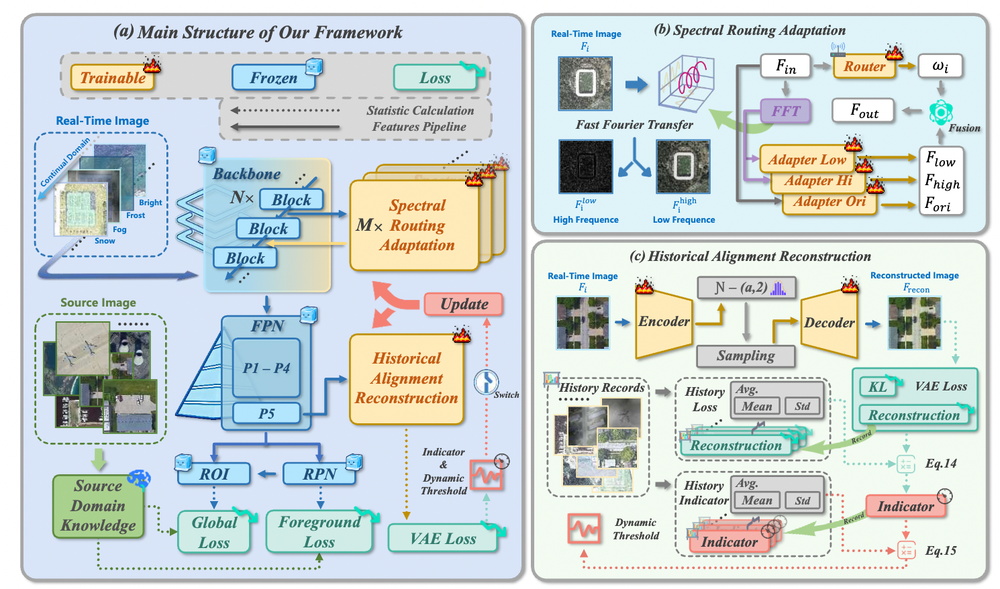

<p align="center">
  <h1 align="center">
    Continual Test-Time Adaptation for Remote Sensing Object Detection
  </h1>
  
  <p align="center">
      Derrick<sup></sup>&emsp;
      <!-- 可后续补充作者 -->
      <br>
      <!-- <h3 align='center'>CVPR 2026</h3> -->
      <div align="center">
      <!-- <a href='https://arxiv.org/abs/XXXX.XXXXX'></a> -->
      <!-- <a href='https://github.com/yourname/yourrepo'></a> -->
      </div>
    <p align='center'>
        If you find our work helpful, please consider giving us a ⭐!
    </p>
   </p>
</p>

<!--
[](https://arxiv.org/abs/XXXX.XXXXX)
[](LICENSE)
-->

Official PyTorch implementation of  **Continual Test-Time Adaptation for Remote Sensing Object Detection**

<div align="center">
  
</div>


---

## ✅ TODO
- [x] Initialize repository structure
- [ ] Release paper link
- [ ] Release pretrained checkpoints

---

## 📖 Introduction

Remote sensing object detection (RSOD) plays a crucial role in applications such as urban planning, disaster response, and environmental monitoring. Despite advances in generic object detection, RSOD remains challenging due to complex variations across sensors, geographic regions, illumination, weather, and object scales, which induce severe domain shifts when models trained on source domains are deployed on unseen target domains. Test-time adaptation (TTA) offers a practical solution by enabling online model adaptation using only incoming test data, but conventional TTA methods generally assume relatively static target distributions, limiting their effectiveness under the dynamic and diverse conditions of RSOD. Continual test-time adaptation for object detection (CTAOD) extends TTA to sequentially arriving test samples, yet existing approaches often rely on global feature updates with fixed thresholds, leading to noisy feature propagation, error accumulation, and catastrophic forgetting. In this paper, we propose CTAOD-RS, a novel framework for continual test-time adaptive object detection in remote sensing imagery. The proposed framework leverages Spectral Routing to decompose features into frequency and spatial components, suppressing noise and clutter, and employs Historical Reconstruction to dynamically determine when model adaptation is necessary, avoiding unnecessary updates and mitigating catastrophic forgetting. Extensive experiments on benchmark RSOD datasets, including the newly introduced DIOR-C corrupted benchmark designed to simulate realistic remote sensing domain shifts, demonstrate superior detection accuracy and robustness compared to existing TTA and CTAOD methods, while maintaining high efficiency. 


---

## 🛠️ Requirements

- Python >= 3.8
- PyTorch >= 1.12
- CUDA >= 11.3 (recommended)
- Other dependencies listed in `requirements.txt`

---

## 🚀 Installation

```bash
# Clone the repository
git clone https://github.com/yourname/yourrepo.git
cd yourrepo

# Create conda environment
conda create -n cttaod python=3.9 -y
conda activate cttaod

# Install PyTorch (adjust CUDA version if needed)
pip install torch torchvision torchaudio

# Install other dependencies
pip install -r requirements.txt
```
---
## 📂 Dataset Preparation

- Download the DIOR-C at the |[Baidu Cloud](https://pan.baidu.com/s/1g01ATN473z3kfr73w88R-A?pwd=rwvf)|
- Download the source features statistics of DIOR at the |[Baidu Cloud](https://pan.baidu.com/s/1pMDURPX_tfUDo1G-T8xLsw?pwd=sv8n)|
---
## 📝 License

- This project is licensed under the MIT License - see the [LICENSE](LICENSE) file for details.
---
## 🙌 Acknowledgments

- Our work is inspired by WHW(https://github.com/natureyoo/ContinualTTA_ObjectDetection) and Earth-Adapter(https://github.com/VisionXLab/Earth-Adapter). We are grateful for their outstanding work and code.
---
